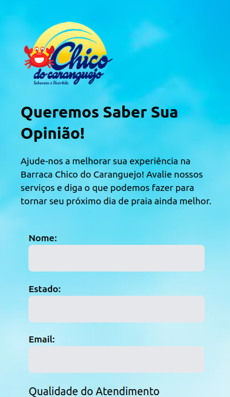
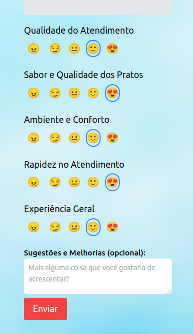

# Sistema de Pesquisa de Satisfação

Este projeto é um sistema de pesquisa de satisfação desenvolvido para coletar feedback de clientes em uma barraca de praia. Ele permite que os clientes avaliem diversos aspectos do atendimento e ambiente, utilizando emojis para simplificar a experiência do usuário.

## Tecnologias Utilizadas

### Frontend:
- **React**: Para criar a interface do usuário.
- **Tailwind CSS**: Para estilização e layout responsivo.
- **Axios**: Para fazer requisições HTTP ao backend.

### Backend:
- **Node.js**: Para o servidor backend.
- **Express**: Framework para lidar com rotas e middleware.
- **CORS**: Para permitir requisições de outras origens (Cross-Origin Resource Sharing).
- **dotenv**: Para gerenciar variáveis de ambiente sensíveis.
- **pg**: Driver para interagir com o banco de dados PostgreSQL.

### Banco de Dados:
- **PostgreSQL**: Banco de dados relacional para armazenar as avaliações.

## Funcionalidades

- Os clientes podem avaliar diferentes categorias, como:
  - Qualidade do Atendimento
  - Sabor e Qualidade dos Pratos
  - Ambiente e Conforto
  - Rapidez no Atendimento
  - Experiência Geral

- As avaliações são realizadas utilizando emojis, que possuem valores numéricos associados (de 1 a 5) e são enviados ao banco de dados.

## Avaliações com Emojis

- 😠 (1) — Ruim
- 😏 (2) — Regular
- 😐 (3) — Bom
- 🙂 (4) — Muito Bom
- 😍 (5) — Excelente

## Exemplo Visual

Aqui está uma captura de tela do sistema em funcionamento:

